# Enterprise Data Processing & Reporting Platform

<p align="center">

<a href="https://aws.amazon.com/">
  
</a>

</p>

<p align="center">


</p>

---

# Project Overview

The **Enterprise Data Processing & Reporting Platform** is a production-oriented, serverless AWS data ingestion pipeline designed to automate the validation, processing, storage, monitoring, and reporting of enterprise customer datasets.

The platform processes CSV files uploaded to Amazon S3, validates every record using AWS Lambda, distributes valid processing requests through Amazon SQS, stores customer data and operational metadata in separate Amazon DynamoDB tables, and provides end-to-end monitoring using Amazon CloudWatch and Amazon SNS.

Unlike a simple proof-of-concept, this project demonstrates a complete production workflow by combining:

- Manual AWS implementation
- Production-grade Terraform Infrastructure as Code
- GitHub Actions CI/CD automation
- End-to-end monitoring and observability
- Secure IAM architecture
- Automated infrastructure deployment and destruction
- Operational audit tracking
- Retry and Dead Letter Queue (DLQ) handling
- Idempotent processing to prevent duplicate data ingestion

The infrastructure is fully reproducible using Terraform and can be validated, deployed, and destroyed through dedicated GitHub Actions workflows, making the platform easy to maintain, scalable, and suitable for real-world enterprise environments.

This project was built to demonstrate practical AWS Cloud Engineering, Infrastructure as Code (IaC), and DevOps skills while following production best practices and interview-ready architectural principles.

---

# Architecture Diagram

> **High-Level AWS Architecture**

<p align="center">
  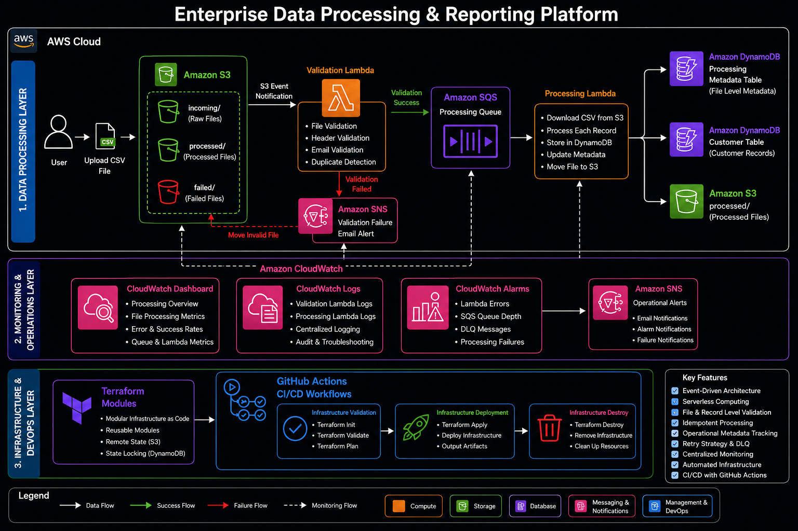
</p>

The following architecture illustrates the complete serverless data processing pipeline, including file ingestion, validation, asynchronous processing, metadata tracking, customer data storage, monitoring, Infrastructure as Code, and CI/CD automation.

---

# Enterprise Monitoring Dashboard

> **End-to-End Operational Dashboard (Amazon CloudWatch)**

<p align="center">
  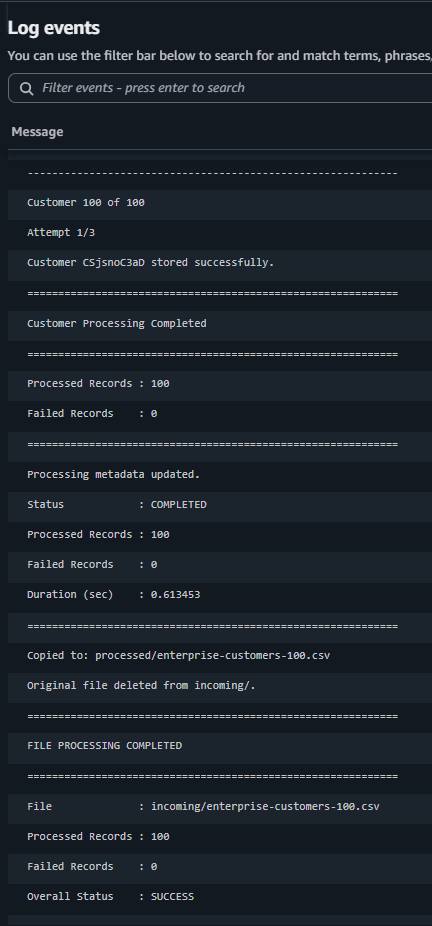
</p>

The CloudWatch dashboard provides a centralized operational view of the entire platform and demonstrates that the solution is fully deployed, monitored, and functioning correctly.

The dashboard includes:

- Validation Lambda invocations and errors
- Processing Lambda invocations and errors
- Amazon SQS queue metrics
- Dead Letter Queue (DLQ) monitoring
- End-to-end processing visibility
- Operational health monitoring

This dashboard serves as the primary operational view for monitoring the health and performance of the Enterprise Data Processing & Reporting Platform.

---

# Table of Contents

- [Project Overview](#project-overview)
- [Architecture Diagram](#architecture-diagram)
- [Enterprise Monitoring Dashboard](#enterprise-monitoring-dashboard)
- [Business Problem](#business-problem)
- [Solution Overview](#solution-overview)
- [Key Features](#key-features)
- [Technology Stack](#technology-stack)
- [High-Level Architecture](#high-level-architecture)
- [End-to-End Workflow](#end-to-end-workflow)
- [S3 File Lifecycle](#s3-file-lifecycle)
- [Repository Structure](#repository-structure)
- [Manual AWS Implementation](#manual-aws-implementation)
- [Terraform Infrastructure as Code](#terraform-infrastructure-as-code)
- [GitHub Actions CI/CD](#github-actions-cicd)
- [Monitoring & Observability](#monitoring--observability)
- [Security Best Practices](#security-best-practices)
- [Project Screenshots](#project-screenshots)
- [Challenges & Solutions](#challenges--solutions)
- [Production Improvements](#production-improvements)
- [Future Enhancements](#future-enhancements)
- [Cleanup](#cleanup)
- [Lessons Learned](#lessons-learned)
- [Interview Talking Points](#interview-talking-points)
- [Author](#author)

---

# Business Problem

Many organizations receive customer, partner, financial, or operational data in CSV format from multiple internal and external sources. Manually validating, processing, and storing these files is time-consuming, error-prone, and difficult to scale.

Common challenges include:

- Invalid or incomplete customer records
- Duplicate data ingestion
- Lack of processing visibility
- Poor error handling
- No operational audit trail
- Limited monitoring and alerting
- Manual infrastructure provisioning
- Inconsistent deployment processes

As data volumes grow, these challenges increase operational complexity and reduce the reliability of enterprise data processing systems.

This project addresses these challenges by building a production-oriented, event-driven AWS platform that automatically validates, processes, stores, monitors, and tracks every uploaded dataset.

---

# Solution Overview

The Enterprise Data Processing & Reporting Platform automates the complete lifecycle of processing customer CSV files using a fully serverless, event-driven architecture on AWS.

The workflow begins when a CSV file is uploaded to Amazon S3. The Validation Lambda verifies the file structure, validates customer records, detects duplicate customer IDs, and publishes valid processing requests to Amazon SQS.

The Processing Lambda consumes messages from the queue, downloads the corresponding CSV file, stores validated customer records in Amazon DynamoDB, updates operational processing metadata, and moves successfully processed files to the appropriate S3 folder.

The platform also implements production-grade operational capabilities including:

- File-level processing metadata
- Customer-level data persistence
- Idempotent processing
- Retry handling
- Dead Letter Queue (DLQ)
- CloudWatch monitoring
- SNS notifications
- Infrastructure as Code using Terraform
- GitHub Actions CI/CD automation

The result is a scalable, maintainable, and production-ready data processing platform that demonstrates modern AWS Cloud Engineering and DevOps practices.

---

# Key Features

## Event-Driven Processing

- Amazon S3 event notifications automatically trigger the Validation Lambda.
- Amazon SQS decouples validation from downstream processing.
- Processing Lambda asynchronously processes validated files.

---

## Automated CSV Validation

The Validation Lambda performs multiple validation checks before a file enters the processing pipeline:

- Required column validation
- Optional column support
- Required field validation
- Email format validation
- Duplicate customer detection

Invalid files are prevented from entering the processing pipeline.

---

## Customer Data Processing

Validated customer records are automatically stored in a dedicated DynamoDB table while maintaining processing metrics and operational status.

---

## Processing Metadata Tracking

A separate DynamoDB table stores operational metadata for every processed file, including:

- Processing status
- Total records
- Processed records
- Failed records
- Processing timestamps
- Processing duration
- Audit information

This separation of business data and operational metadata follows production database design principles.

---

## Intelligent S3 File Lifecycle

The platform automatically organizes files based on processing outcome.

**Valid files**

```
incoming/
        ↓
Validation Successful
        ↓
Processing Successful
        ↓
processed/
```

**Invalid files**

```
incoming/
        ↓
Validation Failed
        ↓
failed/
```

This ensures the upload bucket remains clean while preserving processed and failed datasets for auditing.

---

## Production Reliability

The platform includes several reliability features commonly found in enterprise systems:

- Retry strategy for transient failures
- Dead Letter Queue (DLQ)
- Idempotent processing
- Operational audit logging
- CloudWatch monitoring
- SNS notifications

---

## Infrastructure as Code

The entire AWS infrastructure is provisioned using modular Terraform with:

- Remote S3 backend
- Native state locking
- Reusable modules
- Version pinning
- Shared variables and locals
- Production-ready project structure

---

## CI/CD Automation

GitHub Actions automates the infrastructure lifecycle using dedicated workflows for:

- Infrastructure Validation
- Infrastructure Deployment
- Infrastructure Destruction

The workflows use secure GitHub Secrets, dynamically generate Terraform variables, and support controlled infrastructure management.

---

## Production Monitoring

Amazon CloudWatch provides centralized monitoring through:

- Operational dashboards
- Lambda metrics
- SQS metrics
- DLQ monitoring
- CloudWatch alarms
- SNS alerting

This enables continuous visibility into the health and performance of the platform.

---

# Technology Stack

## Cloud Platform

- Amazon Web Services (AWS)

---

## Infrastructure as Code

- Terraform v1.15.8
- Modular Terraform Architecture
- Amazon S3 Remote Backend
- Native S3 State Locking

---

## Programming Language

- Python 3.13

---

## CI/CD

- GitHub Actions

---

## Version Control

- Git
- GitHub

---

## AWS Services Used

| Service           | Purpose                                  |
| ----------------- | ---------------------------------------- |
| Amazon S3         | CSV file storage and event source        |
| AWS Lambda        | Validation and processing logic          |
| Amazon SQS        | Asynchronous message processing          |
| Amazon SNS        | Email notifications                      |
| Amazon DynamoDB   | Customer data and processing metadata    |
| Amazon CloudWatch | Monitoring, dashboards, alarms, and logs |
| IAM               | Least-privilege access control           |

---

# High-Level Architecture

The platform follows a fully serverless, event-driven architecture that decouples each stage of the data processing pipeline to improve scalability, maintainability, and operational reliability.

```text
                        CSV Upload
                            │
                            ▼
                  Amazon S3 (incoming/)
                            │
                    S3 Event Notification
                            │
                            ▼
                  Validation Lambda
                            │
         ┌──────────────────┴──────────────────┐
         │                                     │
         ▼                                     ▼
 Validation Failed                     Validation Successful
         │                                     │
         ▼                                     ▼
 Amazon SNS Notification                Amazon SQS Queue
         │                                     │
         ▼                                     ▼
 S3 (failed/)                     Processing Lambda
                                                │
                           ┌────────────────────┴────────────────────┐
                           │                                         │
                           ▼                                         ▼
            Processing Metadata Table               Customer Data Table
                    (DynamoDB)                           (DynamoDB)
                           │
                           ▼
                 S3 (processed/)
```

The architecture separates validation, processing, storage, monitoring, and notifications into independent components, allowing each service to scale and operate independently.

---

# End-to-End Workflow

The complete processing lifecycle consists of the following stages:

### Step 1 — File Upload

A CSV file is uploaded to the **incoming/** folder of the Amazon S3 bucket.

---

### Step 2 — Validation

Amazon S3 automatically invokes the **Validation Lambda**.

The Validation Lambda performs:

- File validation
- Header validation
- Required field validation
- Email validation
- Duplicate customer detection

---

### Step 3 — Validation Outcome

If validation fails:

- SNS notification is sent.
- File is moved to **failed/**.
- Processing stops.

If validation succeeds:

- Processing metadata is created.
- Message is published to Amazon SQS.

---

### Step 4 — Queue Processing

The Processing Lambda automatically consumes messages from Amazon SQS.

---

### Step 5 — Record Processing

The Processing Lambda:

- Downloads the CSV file.
- Processes every customer record.
- Stores customer records in the Customer DynamoDB table.
- Updates processing metrics in the Processing Metadata table.

---

### Step 6 — File Completion

After successful processing:

- File is moved to **processed/**.
- Metadata status becomes **COMPLETED**.
- Processing duration is recorded.
- CloudWatch metrics are updated.

---

### Step 7 — Monitoring

Amazon CloudWatch continuously monitors:

- Lambda invocations
- Lambda errors
- Queue depth
- Dead Letter Queue
- Processing health

CloudWatch alarms automatically notify administrators through Amazon SNS when operational issues occur.

---

# S3 File Lifecycle

The platform automatically organizes uploaded files according to the processing outcome.

## Successful Processing

```text
incoming/
        │
        ▼
Validation Lambda
        │
        ▼
Amazon SQS
        │
        ▼
Processing Lambda
        │
        ▼
processed/
```

---

## Validation Failure

```text
incoming/
        │
        ▼
Validation Lambda
        │
        ▼
Amazon SNS Notification
        │
        ▼
failed/
```

This lifecycle ensures that:

- Upload folders remain clean.
- Successfully processed files are archived.
- Invalid datasets are preserved for investigation.
- Every uploaded file has a clear processing outcome.

---

# Design Principles

The platform was designed using production-oriented cloud engineering principles:

- Event-driven architecture
- Loose coupling using Amazon SQS
- Serverless compute with AWS Lambda
- Infrastructure as Code using Terraform
- Immutable infrastructure deployment
- End-to-end observability
- Operational auditability
- Secure IAM least-privilege access
- Automated CI/CD
- Repeatable and reproducible infrastructure

---

# Repository Structure

```text
enterprise-data-processing-platform/
│
├── .github/
│   └── workflows/
│       ├── infrastructure-validation.yml
│       ├── infrastructure-deployment.yml
│       └── infrastructure-destroy.yml
│
├── assets/
│   ├── architecture/
│   └── screenshots/
│
├── lambda/
│   ├── validator/
│   │   └── lambda_function.py
│   └── processor/
│       └── lambda_function.py
│
├── sample-data/
│   ├── valid/
│   └── invalid/
│
├── terraform/
│   ├── backend.tf
│   ├── versions.tf
│   ├── providers.tf
│   ├── variables.tf
│   ├── terraform.tfvars.example
│   ├── locals.tf
│   ├── main.tf
│   ├── outputs.tf
│   ├── modules/
│   │   ├── cloudwatch/
│   │   ├── dynamodb/
│   │   ├── iam/
│   │   ├── lambda-processor/
│   │   ├── lambda-validator/
│   │   ├── s3/
│   │   ├── sns/
│   │   └── sqs/
│   └── scripts/
│
├── .gitignore
└── README.md
```

The repository follows a modular and production-oriented layout that separates infrastructure, application code, documentation, sample datasets, and CI/CD workflows for improved maintainability and scalability.

---

# Manual AWS Implementation

The project was initially implemented manually using the AWS Management Console to gain a deep understanding of how individual AWS services integrate within an event-driven architecture.

The manual implementation included:

- Amazon S3 bucket configuration
- S3 Event Notifications
- Validation Lambda
- Processing Lambda
- Amazon SQS
- Dead Letter Queue (DLQ)
- Amazon SNS
- Processing Metadata DynamoDB table
- Customer Data DynamoDB table
- Amazon CloudWatch Dashboard
- CloudWatch Alarms
- IAM Roles and Policies
- End-to-end functional testing

Building the platform manually before introducing Infrastructure as Code provided practical experience with AWS service configuration, permissions, event integration, troubleshooting, and operational testing.

---

# Terraform Infrastructure as Code

After validating the complete manual implementation, the entire infrastructure was rebuilt using Terraform following production-grade Infrastructure as Code principles.

## Terraform Foundation

The Terraform project was designed using a standardized, modular architecture.

Key implementation decisions included:

- Modular Terraform architecture
- Version-pinned Terraform and AWS Provider
- Amazon S3 Remote Backend
- Native S3 State Locking
- Reusable infrastructure modules
- Shared variables and locals
- Environment-driven configuration
- Production-ready directory structure

---

## Terraform Modules

Each AWS service is implemented as an independent reusable module.

| Module           | Responsibility                                  |
| ---------------- | ----------------------------------------------- |
| S3               | Object storage, versioning, event notifications |
| IAM              | Roles, policies, and permissions                |
| Lambda Validator | Validation Lambda deployment                    |
| Lambda Processor | Processing Lambda deployment                    |
| SQS              | Processing Queue and Dead Letter Queue          |
| SNS              | Notification topic and email subscription       |
| DynamoDB         | Customer and Processing Metadata tables         |
| CloudWatch       | Dashboard, alarms, and monitoring               |

This modular design improves maintainability, reusability, and simplifies future enhancements.

---

## Remote State Management

Terraform state is stored remotely using Amazon S3.

Benefits include:

- Shared team access
- Centralized state management
- Versioned infrastructure state
- Protection against local state loss
- Native state locking
- Consistent infrastructure deployments

This follows Terraform best practices for collaborative Infrastructure as Code projects.

---

## Environment-Driven Configuration

Sensitive configuration values are not hardcoded.

Terraform variables and GitHub Secrets are used to configure:

- AWS Region
- Project Name
- Environment
- S3 Bucket Name
- Notification Email

Lambda functions receive infrastructure-specific configuration through environment variables, making the application portable across environments.

---

# GitHub Actions CI/CD

The project automates the infrastructure lifecycle using GitHub Actions.

Three dedicated workflows were implemented to separate validation, deployment, and destruction responsibilities.

---

## Infrastructure Validation

Automatically validates infrastructure changes whenever Terraform code is modified.

The workflow performs:

- Repository checkout
- Terraform installation
- AWS authentication
- Dynamic terraform.tfvars generation
- Terraform formatting validation
- Terraform initialization
- Terraform validation
- Terraform execution plan

This ensures infrastructure changes are verified before deployment.

---

## Infrastructure Deployment

Infrastructure deployment is intentionally executed through a manual workflow to provide controlled production deployments.

The workflow performs:

- Repository checkout
- Terraform installation
- AWS authentication
- terraform.tfvars generation
- Terraform validation
- Terraform execution plan
- Plan artifact upload
- Infrastructure deployment

To reduce the risk of accidental deployments, the workflow requires manual confirmation by entering:

```text
APPLY
```

before infrastructure changes are applied.

---

## Infrastructure Destroy

Infrastructure cleanup is managed through a dedicated manual workflow.

The workflow performs:

- Repository checkout
- Terraform initialization
- Terraform validation
- Destroy plan generation
- Destroy plan artifact upload
- Infrastructure destruction

To prevent accidental deletion of AWS resources, the workflow requires manual confirmation by entering:

```text
DESTROY
```

before Terraform removes any infrastructure.

---

## CI/CD Benefits

Implementing GitHub Actions provides several operational advantages:

- Automated infrastructure validation
- Consistent deployment process
- Controlled infrastructure destruction
- Secure AWS authentication
- Dynamic configuration generation
- Infrastructure plan artifacts
- Reduced manual effort
- Repeatable deployments
- Production-ready Infrastructure as Code workflow

---

# Monitoring & Observability

Operational visibility is a critical requirement for production systems. This platform implements centralized monitoring using Amazon CloudWatch to provide real-time insight into application health, infrastructure performance, and processing activity.

---

## Amazon CloudWatch Dashboard

A centralized CloudWatch dashboard provides a real-time operational view of the platform.

The dashboard includes:

- Validation Lambda invocations
- Validation Lambda errors
- Processing Lambda invocations
- Processing Lambda errors
- Amazon SQS queue depth
- Dead Letter Queue (DLQ) metrics

### Dashboard Overview

<p align="center">
    
</p>

---

## CloudWatch Alarms

Production alarms automatically monitor the health of the platform.

Implemented alarms include:

| Alarm                      | Purpose                                           |
| -------------------------- | ------------------------------------------------- |
| Validation Lambda Errors   | Detects failures during CSV validation            |
| Processing Lambda Errors   | Detects runtime failures while processing records |
| Processing Queue Backlog   | Detects increasing queue depth                    |
| Dead Letter Queue Messages | Detects failed messages requiring investigation   |

Whenever an alarm enters the **ALARM** state, Amazon SNS automatically sends an email notification to the configured administrator.

---

## Amazon SNS Notifications

Amazon SNS provides automated operational notifications.

Notification scenarios include:

- Invalid CSV file detected
- Validation failure
- CloudWatch alarm triggered

This ensures administrators receive immediate visibility into operational issues without manually monitoring the AWS Console.

---

# Security Best Practices

Security was incorporated throughout the project following AWS best practices.

---

## IAM Least Privilege

Dedicated IAM roles were created for each Lambda function.

Permissions were restricted to only the AWS resources required by each function.

Examples include:

- Amazon S3
- Amazon SQS
- Amazon SNS
- Amazon DynamoDB
- Amazon CloudWatch Logs

No Lambda function was granted unnecessary administrative permissions.

---

## Infrastructure Configuration

Infrastructure-specific values are not hardcoded inside the application.

Terraform injects configuration through Lambda environment variables.

Examples include:

- Processing Metadata Table
- Customer Table
- Queue URL
- SNS Topic ARN
- Dead Letter Queue URL

This approach improves portability while keeping application code environment-independent.

---

## GitHub Secrets

Sensitive values are securely managed using GitHub Secrets.

Examples include:

- AWS Access Key ID
- AWS Secret Access Key

Terraform variables are generated dynamically during GitHub Actions workflow execution rather than stored in the repository.

---

## Secure Infrastructure as Code

Terraform follows several Infrastructure as Code best practices.

Implemented practices include:

- Remote S3 Backend
- Native State Locking
- Modular Architecture
- Version Pinning
- Shared Variables
- Shared Locals
- Reusable Modules

This ensures infrastructure remains reproducible, maintainable, and secure.

---

# Project Screenshots

The following screenshots document the complete implementation journey of the Enterprise Data Processing & Reporting Platform, from file validation through infrastructure automation.

---

## Phase 1 — Validation Pipeline

### 01. S3 Event Successfully Triggering Validation Lambda

<p align="center">
    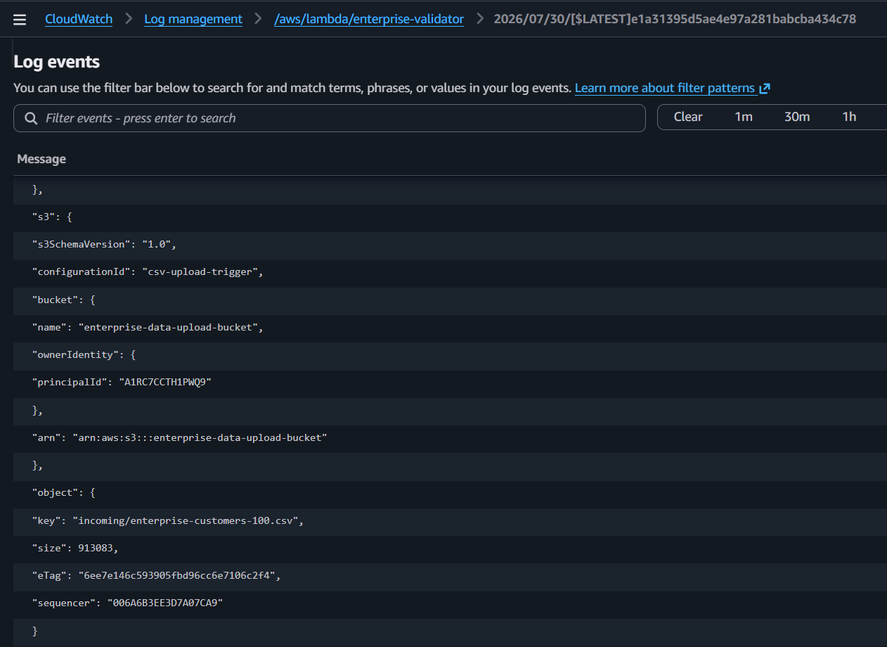
</p>

---

### 02. Row-Level Email Validation

<p align="center">
    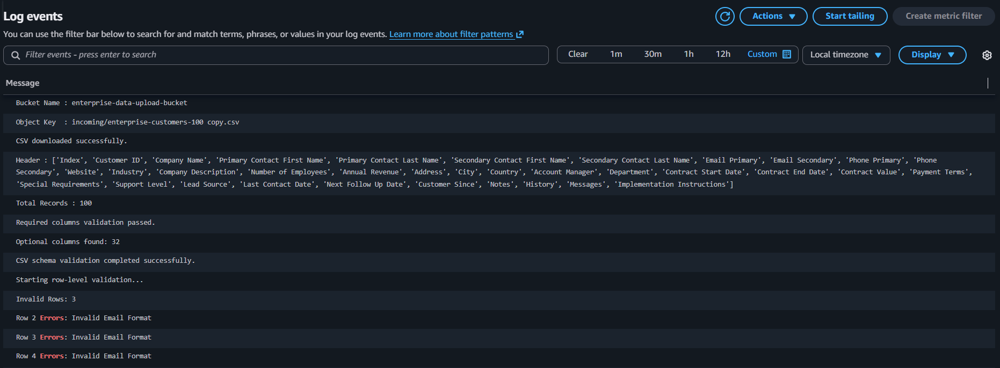
</p>

---

### 03. Successful SQS Message Publishing

<p align="center">
    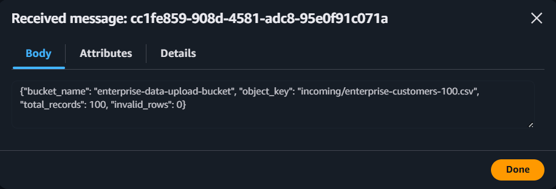
</p>

---

### 04. Invalid File Blocked Before Processing

<p align="center">
    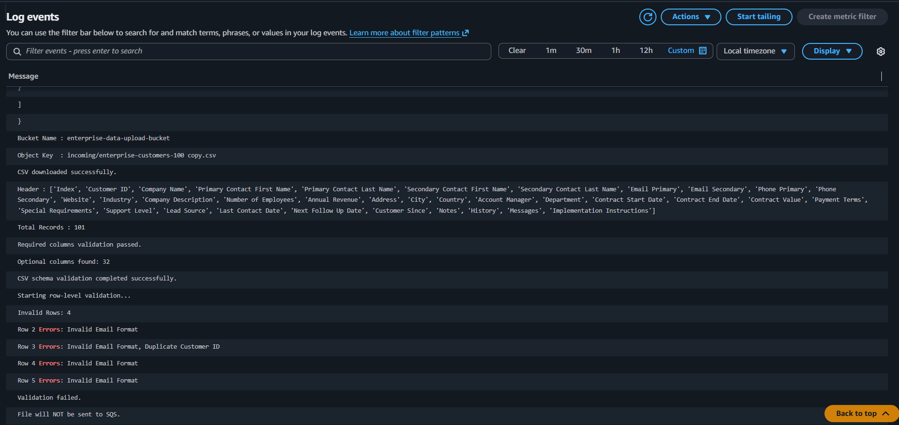
</p>

---

### 05. Validation Failure Email Notification

<p align="center">
    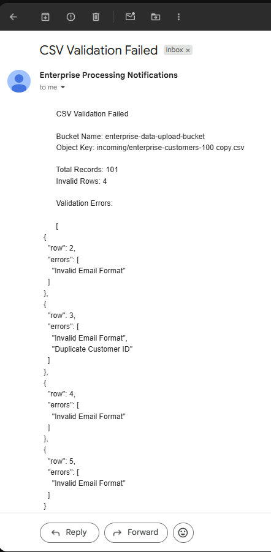
</p>

---

### 06. Invalid File Archived

<p align="center">
    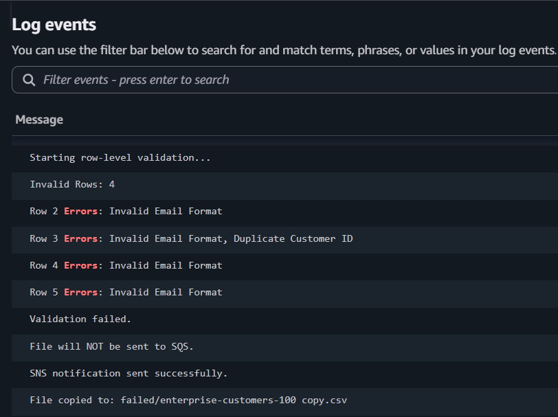
</p>

---

## Phase 2 — Processing Pipeline

### 07. Processing Lambda Triggered from Amazon SQS

<p align="center">
    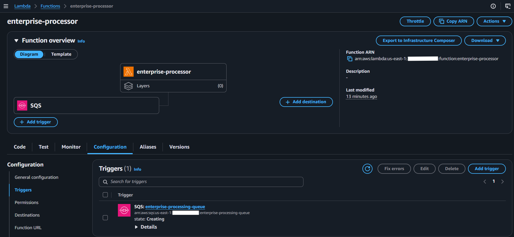
</p>

---

### 08. Processing Lambda Downloading CSV File

<p align="center">
    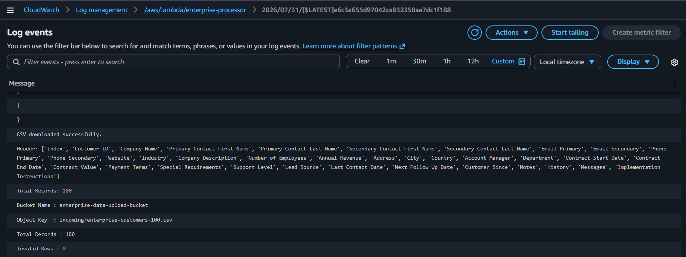
</p>

---

### 09. Processing Metadata Created

<p align="center">
    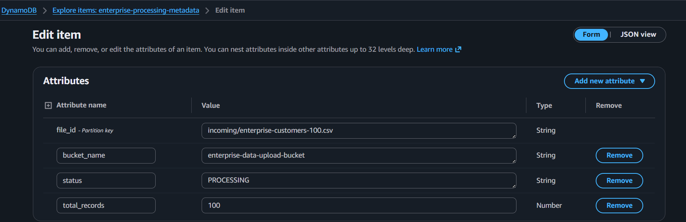
</p>

---

### 10. Successfully Processed File Archived

<p align="center">
    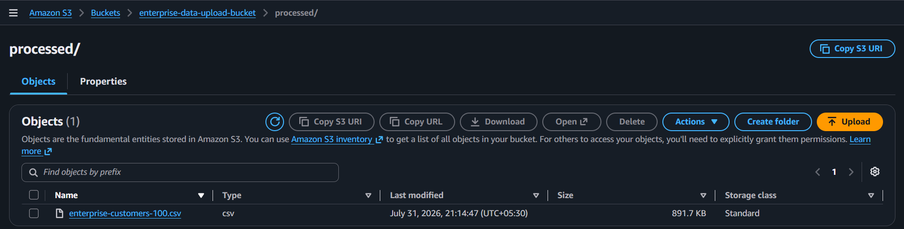
</p>

---

### 11. Failed File Archived

<p align="center">
    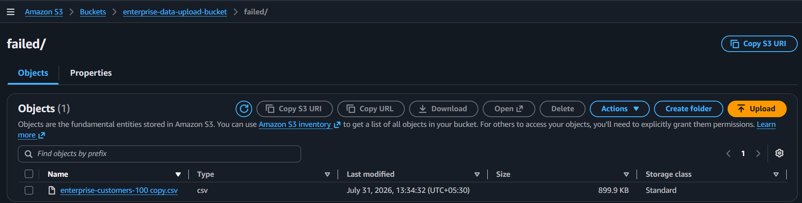
</p>

---

### 12. Processing Status Updated

<p align="center">
    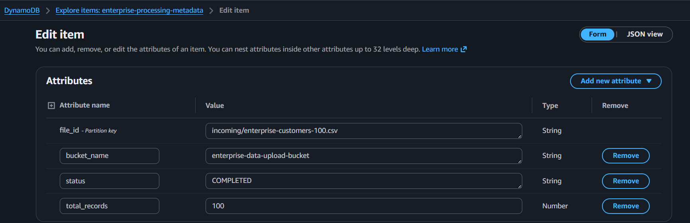
</p>

---

### 13. Processing Audit Fields

<p align="center">
    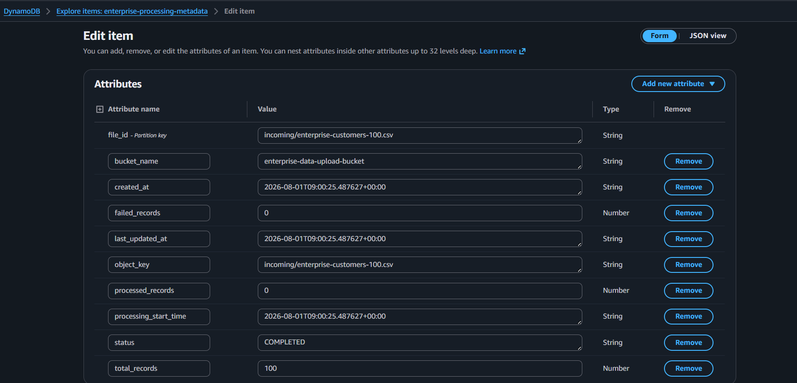
</p>

---

### 14. Production Processing Metadata

<p align="center">
    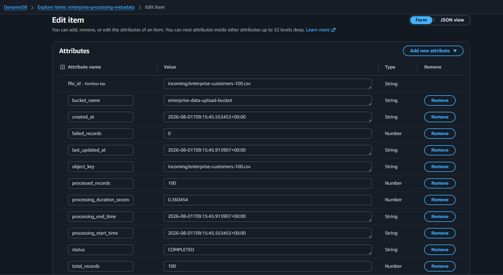
</p>

---

### 15. Idempotent Processing Verification

<p align="center">
    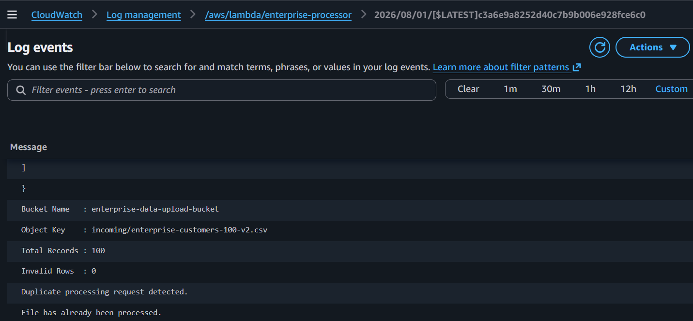
</p>

---

### 16. Record-Level Processing Metrics

<p align="center">
    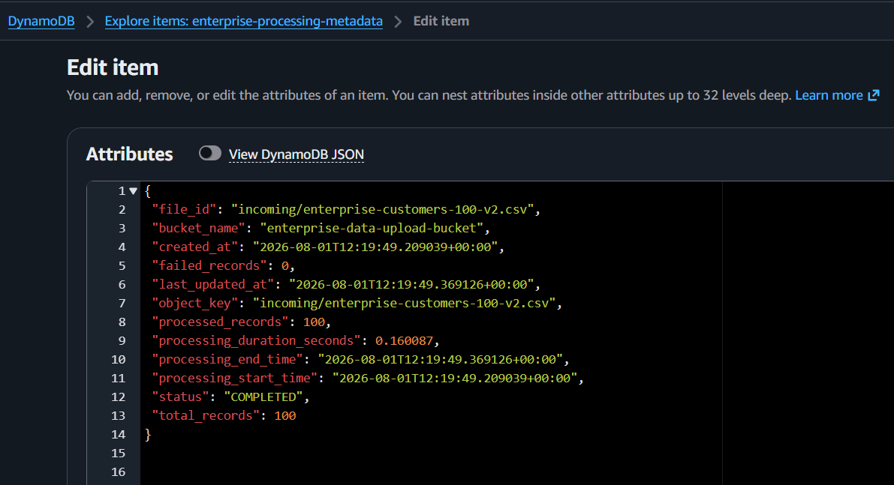
</p>

---

### 17. Retry Strategy

<p align="center">
    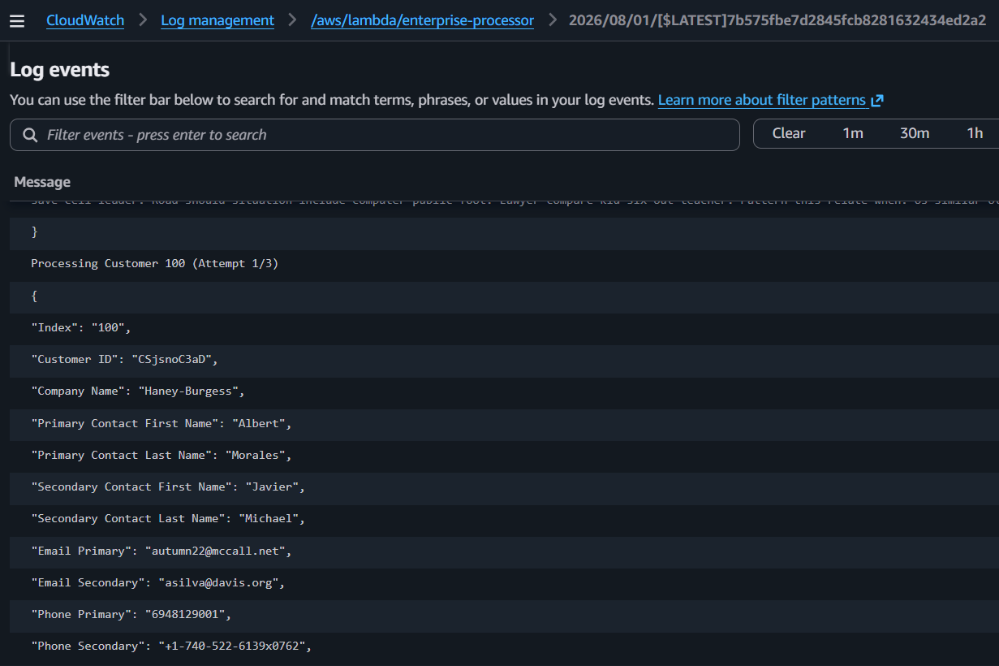
</p>

---

### 18. Customer DynamoDB Table

<p align="center">
    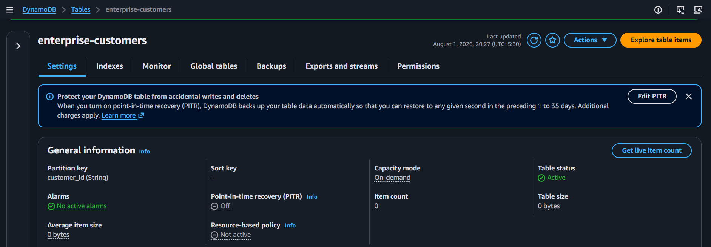
</p>

---

### 19. Customer Data Stored Successfully

<p align="center">
    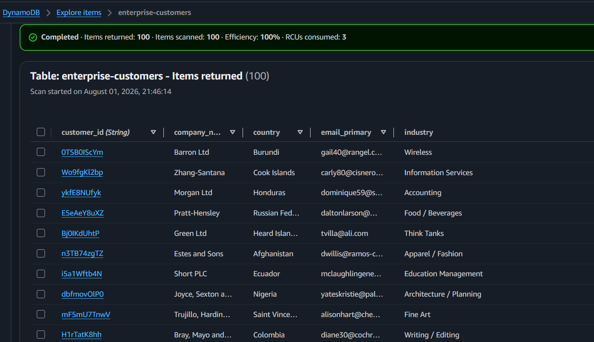
</p>

---

### 20. Customer Record Dead Letter Queue

<p align="center">
    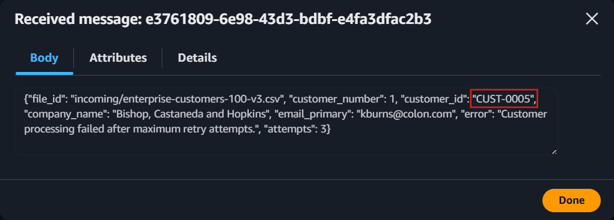
</p>

---

## Phase 3 — Platform Monitoring

### 21. Enterprise CloudWatch Dashboard

<p align="center">
    
</p>

---

## Phase 4 — Infrastructure Automation (GitHub Actions)

### 22. GitHub Actions Repository Secrets

<p align="center">
    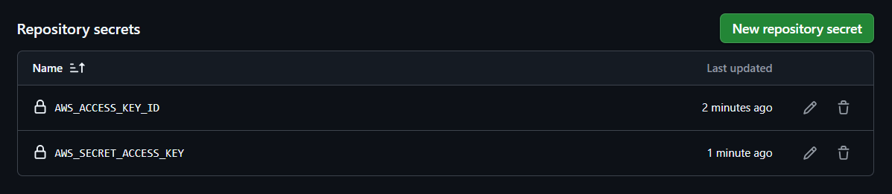
</p>

---

### 23. Infrastructure Deployment Workflow

<p align="center">
    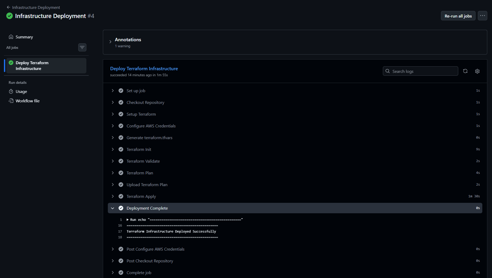
</p>

---

### 24. Infrastructure Destroy Workflow

<p align="center">
    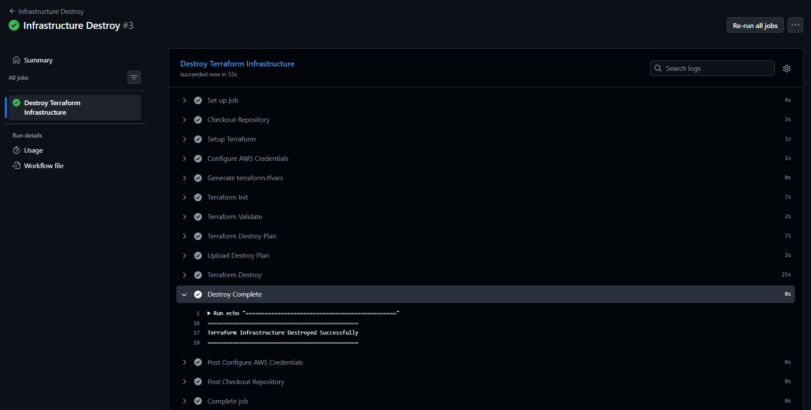
</p>
These screenshots demonstrate the complete implementation journey—from event-driven serverless processing to Infrastructure as Code and automated CI/CD—showing both the technical architecture and the operational maturity of the platform.

---

# Challenges & Solutions

Building a production-ready event-driven platform involved several engineering challenges. Each challenge provided valuable practical experience in AWS architecture, troubleshooting, Infrastructure as Code, and operational reliability.

| Challenge                                          | Solution                                                                                                    |
| -------------------------------------------------- | ----------------------------------------------------------------------------------------------------------- |
| Invalid CSV files entering the processing pipeline | Implemented a dedicated Validation Lambda to validate file structure and record data before processing.     |
| Duplicate customer processing                      | Introduced idempotent processing using the Processing Metadata DynamoDB table.                              |
| Tight coupling between validation and processing   | Decoupled both stages using Amazon SQS for asynchronous processing.                                         |
| Processing failures                                | Implemented retry logic and configured a Dead Letter Queue (DLQ).                                           |
| Limited operational visibility                     | Built CloudWatch dashboards, alarms, and centralized logging.                                               |
| Manual infrastructure provisioning                 | Rebuilt the complete platform using modular Terraform Infrastructure as Code.                               |
| Environment-specific configuration                 | Removed hardcoded values and injected configuration through Terraform-managed Lambda environment variables. |
| Manual deployments                                 | Automated validation, deployment, and destruction using GitHub Actions CI/CD.                               |

---

# Production Improvements

Compared to the initial manual implementation, several production-grade improvements were introduced.

## Infrastructure

- Modular Terraform architecture
- Amazon S3 remote backend
- Native S3 state locking
- Version-pinned Terraform and AWS Provider
- Reusable Terraform modules
- Environment-driven configuration
- Shared variables and locals

---

## Application

- Record-level validation
- Idempotent processing
- Operational metadata tracking
- Retry strategy
- Dead Letter Queue (DLQ)
- Automatic file archival
- Environment-variable driven configuration

---

## Monitoring

- CloudWatch Dashboard
- CloudWatch Alarms
- Amazon SNS Notifications
- Centralized CloudWatch Logs
- Processing metrics
- Queue monitoring
- DLQ monitoring

---

## DevOps

- GitHub Actions Infrastructure Validation
- GitHub Actions Infrastructure Deployment
- GitHub Actions Infrastructure Destruction
- Dynamic Terraform variable generation
- Secure GitHub Secrets
- Terraform execution plan artifacts

---

# Future Enhancements

Potential enhancements that could further extend the platform include:

- API Gateway for external data ingestion
- Amazon EventBridge for advanced event routing
- AWS Step Functions for complex orchestration
- Amazon Athena for querying processed datasets
- Amazon QuickSight dashboards for business reporting
- Amazon OpenSearch for searchable customer records
- Multi-environment deployments (Development, Staging, Production)
- Terraform environment workspaces
- Automated Lambda unit and integration testing
- GitHub Actions approval gates for production deployments
- AWS Config and Security Hub integration
- Cost monitoring dashboards
- Multi-region disaster recovery

---

# Cleanup

The project demonstrates the complete Infrastructure as Code lifecycle.

```text
Design
    ↓
Manual AWS Implementation
    ↓
Terraform Modules
    ↓
Validation
    ↓
Deployment
    ↓
Verification
    ↓
Monitoring
    ↓
Documentation
    ↓
Infrastructure Destruction
```

Using the dedicated **Infrastructure Destroy** workflow, all Terraform-managed AWS resources can be removed safely, helping prevent unnecessary cloud costs while maintaining a fully reproducible deployment process.

---

# Lessons Learned

This project provided practical experience across multiple cloud engineering disciplines.

Key takeaways include:

- Designing event-driven serverless architectures
- Building loosely coupled systems using Amazon SQS
- Implementing production-ready Lambda functions
- Applying Infrastructure as Code using Terraform
- Managing remote Terraform state
- Designing reusable Terraform modules
- Building secure IAM least-privilege policies
- Implementing operational monitoring with CloudWatch
- Automating infrastructure using GitHub Actions
- Troubleshooting AWS service integrations
- Designing reliable and maintainable cloud platforms
- Applying production engineering best practices throughout the infrastructure lifecycle

---

# Key Points

This project demonstrates practical experience with the following topics commonly discussed during AWS Cloud Engineer, DevOps Engineer, and Platform Engineer interviews.

## AWS

- Amazon S3
- AWS Lambda
- Amazon SQS
- Amazon SNS
- Amazon DynamoDB
- Amazon CloudWatch
- IAM

---

## Terraform

- Modular Infrastructure as Code
- Remote State Backend
- Native State Locking
- Variables and Locals
- Reusable Modules
- Resource Dependencies
- Production Infrastructure Design

---

## DevOps

- GitHub Actions
- CI/CD Pipelines
- Infrastructure Validation
- Automated Deployments
- Automated Infrastructure Destruction
- Secure Secret Management

---

## Architecture

- Event-Driven Architecture
- Serverless Computing
- Loose Coupling
- Asynchronous Processing
- Idempotent Processing
- Dead Letter Queue (DLQ)
- Retry Strategy
- Operational Monitoring
- Production Reliability

---
